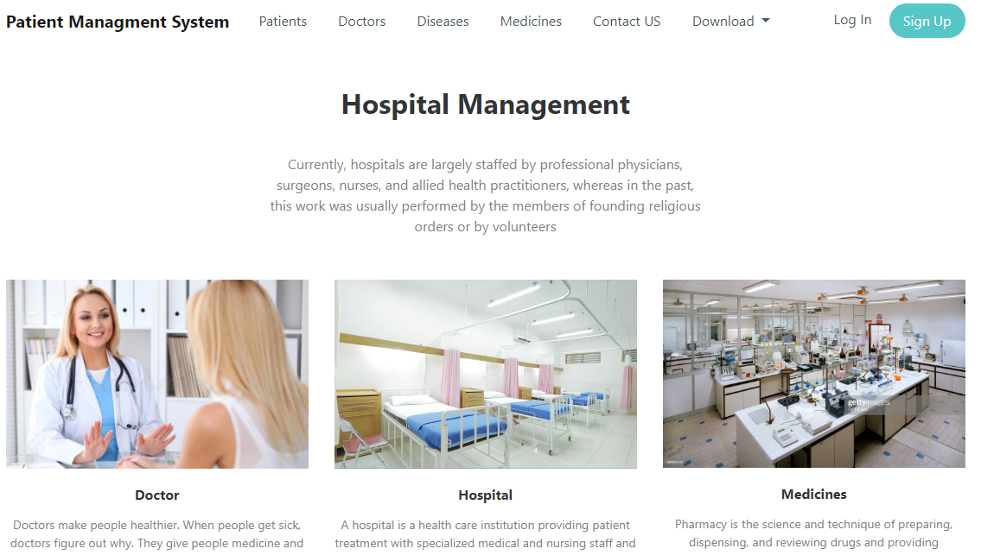
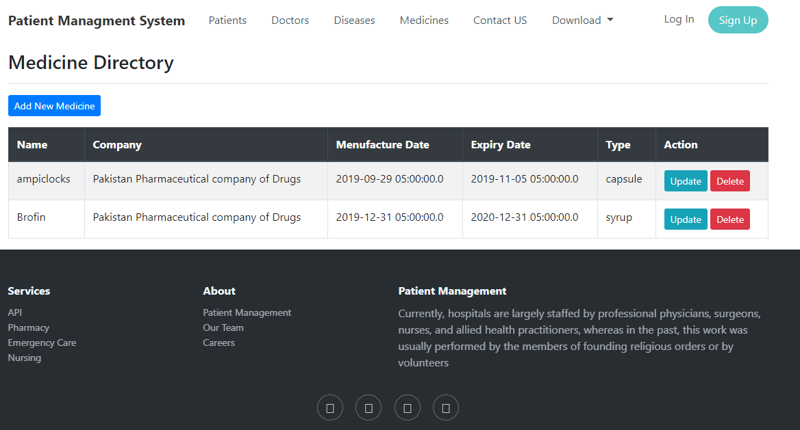
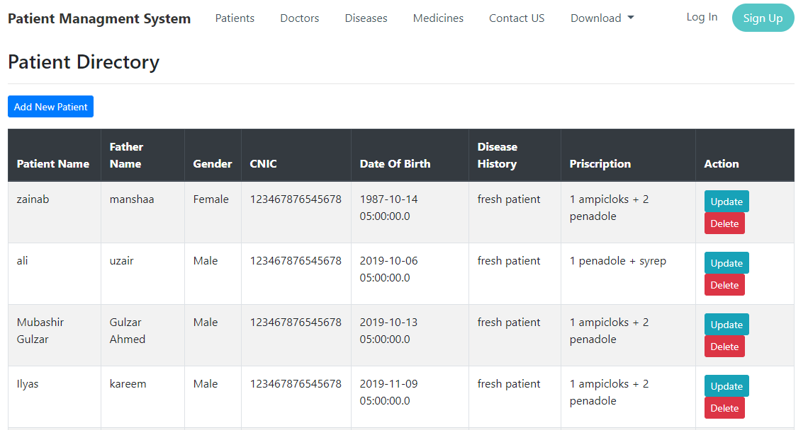
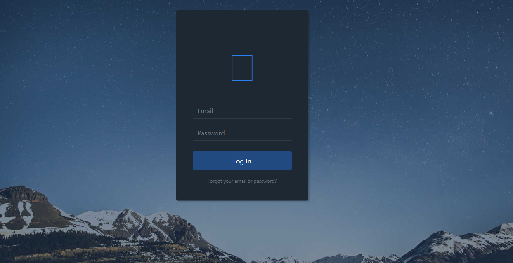
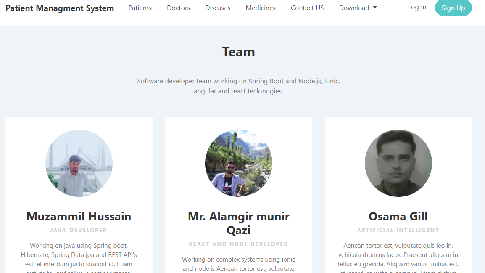

# Hospital Managment Application.
<h3>Frontend Work</h3>
Tools and technologies  
•	HTML, CSS, Bootstrat and Spring thmeleafe used for front-end. 
•	mySQL database and Spring Boot and Hibernate used for backed work.   
Features in our Application. 

1.	Manage Records (CRUD) 
•	Manage Doctor, patient, disease, medicine records . 
•	Manage Contact service to help the app users. 

2.	Services and About us  
•	API, Pharmacy, Emergency Care, Nursing.  
•	About, Patient Management, Our Team, Career.  

3.	Download reports  
•	You can download patient, doctors, medicines and diseases report. 
•	Reports are downloaded montly, yearly and daily bases.  

4.	API  
•	REST API end points for GET, POST, UPDATE, DELETE and PATCH the entities.  
•	Data is given in JSON formate and recieved in JSON.

<h3><a href="https://youtu.be/3BQ3oRV8ubM">Click here to view Demo video</a></h3>

<h3>Screenshots</h3>

Home.
 

Medicine Directory.
 

Patient Diarctory
 

Login
 

Team
 

